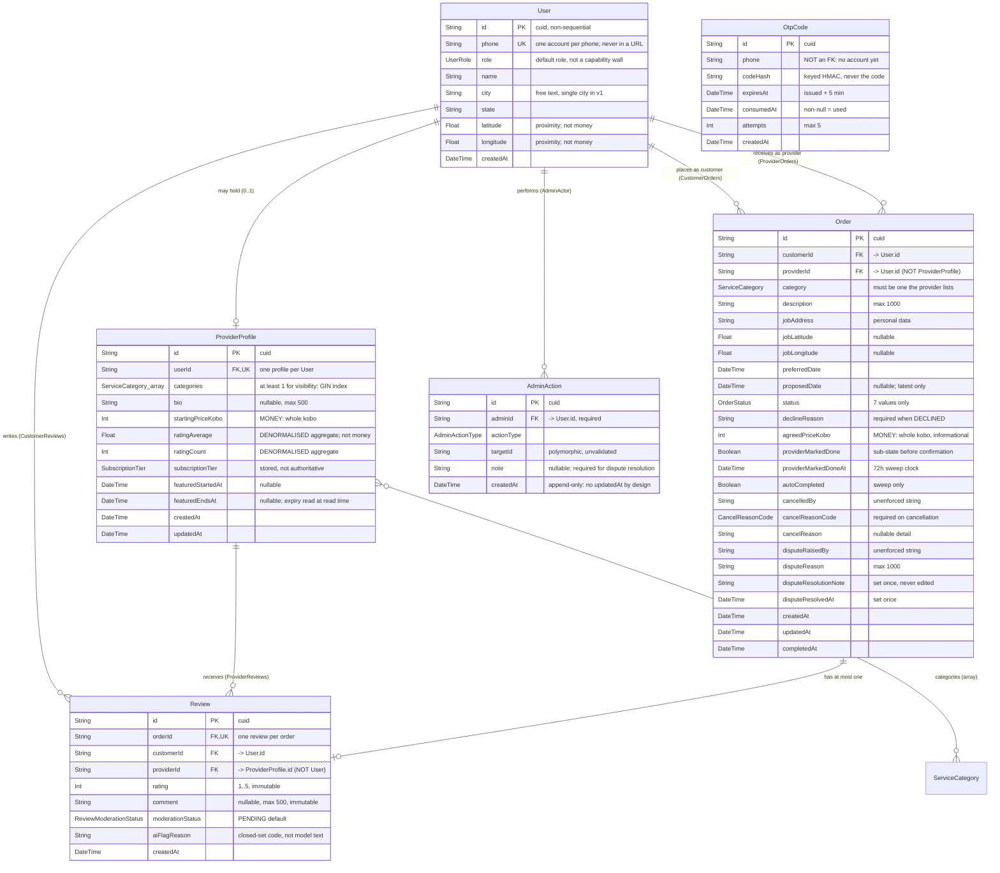

# Fixora — Data Model (Task 3, Checkpoint 2)

Modeled from PRD §10. §10 is the locked base: every model, enum, field and relation below is
reproduced exactly as the PRD defines it (DB-1). Nothing is renamed, removed, or retyped. Where
this document needed a decision the PRD does not make, it is written down as a flag, not resolved
(`03-design-decisions.md` §11 holds the full list).

Enums are closed sets. A new value in any of them is a new business state and requires a stop-and-ask
(DB-2, AGENTS Q7). TypeScript equivalents are the Prisma-generated ones named in AGENTS Q5:
`UserRole`, `ServiceCategory`, `OrderStatus`, `CancelReasonCode`, `ReviewModerationStatus`,
`SubscriptionTier`, `AdminActionType`.

---

## 1. Entity summary

| # | Entity | Purpose | Primary requirement |
|---|---|---|---|
| 1 | `User` | One account: Customer, Provider or Admin by *default* role. May also hold a `ProviderProfile`. | PR-AUTH-001, PR-AUTH-005 |
| 2 | `ProviderProfile` | The provider-offering extension of a `User`: categories, starting price, aggregate rating, subscription tier. | PR-PROVIDER-001, PR-PROVIDER-002 |
| 3 | `OtpCode` | A short-lived, single-use code issued for phone verification. | PR-AUTH-002, PR-TECH-002 |
| 4 | `Order` | One service request and its whole lifecycle. | PR-ORDER-002, PR-ORDER-003 |
| 5 | `Review` | One review, against exactly one completed order. | PR-REVIEW-001 |
| 6 | `AdminAction` | Append-only record of one admin decision. | PR-ADMIN-004 |

Six models. There is no `Transaction`, no `Payment`, no `City`, no upload/attachment, no
verification record, and no moderation-keyword table. Each omission is deliberate and traceable
to the v1 exclusions in `01-requirements.md` ("What the product does") and the five actions it
spells out.

---

## 2. Entities in detail

### 2.1 `User` → table `users`

**Definition.** A single account, identified by a verified phone number. `role` records which
experience the account opens by default; it is not a capability wall (PR-AUTH-005). A `User` with
`role = CUSTOMER` may also own a `ProviderProfile`; a `User` with `role = PROVIDER` may also place
orders as a customer. `role = ADMIN` is the sole account type with no customer or provider
capability layered on it.

| Field | Type | Required | Default | Notes |
|---|---|---|---|---|
| `id` | `String` | yes | `cuid()` | Primary identifier. Non-sequential (Checkpoint 3 §7). |
| `phone` | `String` | yes | — | **Unique.** One account per phone (PR-AUTH-001). Personal data under NDPR: never in a URL or query string, never logged unmasked (SEC-12). |
| `role` | `UserRole` | yes | — | `CUSTOMER` \| `PROVIDER` \| `ADMIN`. Default role only (PR-AUTH-005). Never client-writable (SEC-6). |
| `name` | `String` | yes | — | Completed at signup (PR-AUTH-004). |
| `city` | `String` | yes | — | Free text. v1 is single-city but there is no `City` entity and no cross-city search (PR-SEARCH-003, Open Question 8). |
| `state` | `String` | yes | — | Free text. |
| `latitude` | `Float` | yes | — | Proximity. **Not money** — coordinates are `Float` by design (DB-5). Indexed; see Checkpoint 3 §9. |
| `longitude` | `Float` | yes | — | As above. |
| `createdAt` | `DateTime` | yes | `now()` | Server clock, UTC (CS-7). |

**Identifier.** `id` is the only identifier used in relations and in API paths. `phone` is a
*unique natural key* — it enforces one-account-per-phone — but it is not a public identifier:
SEC-12 forbids putting a phone number in a URL or query string, so no endpoint is ever
`/users/by-phone/:phone`.

**No `updatedAt`.** The PRD defines none, and DB-1 makes adding one a schema change. PRD v1
defines no route that edits a `User` profile, so there is currently no write that would move it.
If PR-AUTH-004 profile editing is ever added, `updatedAt` ships with it as an additive change.
Flagged rather than pre-empted.

**Deleted rows.** None. See Checkpoint 3 §5.

### 2.2 `ProviderProfile` → table `provider_profiles`

**Definition.** Everything specific to *offering* a service, as opposed to having an account. One
per `User` at most, and existence of a profile is what grants provider capability — not `role`
(PR-AUTH-005, CS-9).

| Field | Type | Required | Default | Notes |
|---|---|---|---|---|
| `id` | `String` | yes | `cuid()` | Primary identifier. **Note:** `Review.providerId` points *here*, while `Order.providerId` points at `User.id`. See §4.1. |
| `userId` | `String` | yes | — | **Unique**, FK → `User.id`, `onDelete: Restrict`. One profile per account (DB-11). |
| `categories` | `ServiceCategory[]` | yes | — | Postgres array. At least one entry is required for search visibility (PR-PROVIDER-002, PR-SEARCH-002). Requires a GIN index, which Prisma's DSL cannot emit (AGENTS Q2, DB-4). |
| `bio` | `String?` | no | — | Max 500 characters. Enforced in the module, not by a DB constraint — it is a business rule (PR-PROVIDER-001), and the length cap is a *validation* concern. |
| `startingPriceKobo` | `Int` | yes | — | **Money.** Whole kobo, never float/decimal (PR-TECH-007, DB-5, MB-1). Informational only; binds nothing (PR-PROVIDER-003, MB-3). |
| `ratingAverage` | `Float` | yes | `0` | Denormalised aggregate (PR-TECH-006). **Not money** — a Float by design (DB-5). One writer only (DB-8). |
| `ratingCount` | `Int` | yes | `0` | Denormalised aggregate, same writer. |
| `subscriptionTier` | `SubscriptionTier` | yes | `FREE` | Stored, but **not authoritative** — the effective tier is computed at read (PR-SUB-004, CS-8, MB-6). |
| `featuredStartedAt` | `DateTime?` | no | — | Required when tier is `FEATURED` (PR-SUB-004, MB-7). Never client-writable (SEC-6, MB-8). |
| `featuredEndsAt` | `DateTime?` | no | — | Expiry is read-time, not a reset job (MB-7). |
| `createdAt` | `DateTime` | yes | `now()` | |
| `updatedAt` | `DateTime` | yes | `@updatedAt` | Maintained by Prisma on every write. |

**Location is not on this model.** `city`, `state`, `latitude` and `longitude` live on `User`, not
here — so the proximity search must join `provider_profiles` to `users`, and the proximity index
belongs on `users` (DB-4 anticipated exactly this: *"the PRD requires indexed latitude/longitude
columns, but §10 defines none"*). See §4.3 for the discrepancy this creates against PR-PROVIDER-001.

### 2.3 `OtpCode` → table `otp_codes`

**Definition.** A 6-digit code issued to a phone number, valid 5 minutes, single use. Requesting a
new code for the same phone invalidates any prior unconsumed one (PR-AUTH-002).

| Field | Type | Required | Default | Notes |
|---|---|---|---|---|
| `id` | `String` | yes | `cuid()` | Primary identifier. |
| `phone` | `String` | yes | — | **Not a foreign key.** An OTP is requested by someone who has no account yet (PR-AUTH-004), so a FK to `User` is impossible. Indexed with `consumedAt` for the "invalidate previous" lookup. |
| `codeHash` | `String` | yes | — | Keyed HMAC, **never the code** (SEC-1). A plain hash of a 6-digit code is trivially reversible. Never returned, never logged (AGENTS rule 4). |
| `expiresAt` | `DateTime` | yes | — | `issuedAt + 5 min`, server clock (PR-AUTH-002, CS-7). |
| `consumedAt` | `DateTime?` | no | — | Non-null means used. Single-use is enforced here, atomically (SEC-2). |
| `attempts` | `Int` | yes | `0` | Incremented **before** comparison so parallel guesses cannot exceed 5 (SEC-2, PR-AUTH-003). |
| `createdAt` | `DateTime` | yes | `now()` | |

**No `updatedAt`.** Consuming a code and incrementing its attempt counter are not profile edits;
the meaningful transition timestamps are `expiresAt` and `consumedAt`.

**No originating-IP column.** PR-TECH-002a requires 10 sends per IP per hour, and SEC-11 states
plainly that *"the schema has nowhere to store an IP, so stop and flag that; never ship a
per-instance in-memory counter."* Flagged — not modelled, and not worked around. See
`03-design-decisions.md` §11.

### 2.4 `Order` → table `orders`

**Definition.** One service request from one customer to one provider, and the complete record of
its lifecycle. The richest model in the schema and the one carrying almost every business rule.

| Field | Type | Required | Default | Notes |
|---|---|---|---|---|
| `id` | `String` | yes | `cuid()` | Primary identifier. |
| `customerId` | `String` | yes | — | FK → `User.id`, `Restrict`. Relation `"CustomerOrders"`. Never client-writable; from the session (CS-6, SEC-6). |
| `providerId` | `String` | yes | — | FK → `User.id`, `Restrict`. Relation `"ProviderOrders"`. **Points at `User`, not `ProviderProfile`** — see §4.1. |
| `category` | `ServiceCategory` | yes | — | Must be one of the provider's listed categories (PR-ORDER-001). Enforced in the module; a cross-row predicate is not expressible as a CHECK constraint. |
| `description` | `String` | yes | — | Max 1000 characters (PR-ORDER-001). |
| `jobAddress` | `String` | yes | — | Personal data (SEC-12). Never logged, never in a URL. |
| `jobLatitude` | `Float?` | no | — | Optional pin for the job site. |
| `jobLongitude` | `Float?` | no | — | As above. |
| `preferredDate` | `DateTime` | yes | — | Requested time. Updated if a proposed date is accepted (PR-ORDER-005). |
| `proposedDate` | `DateTime?` | no | — | Provider's alternate. Status stays `REQUESTED` (PR-ORDER-005). Holds only the latest proposal; no count, so no cap is representable (Open Question 9). |
| `status` | `OrderStatus` | yes | `REQUESTED` | Seven values only (PR-ORDER-003, DB-2). Every transition is one named function (CS-3). |
| `declineReason` | `String?` | no | — | Required when `DECLINED`, max 300 chars (PR-ORDER-004). |
| `agreedPriceKobo` | `Int?` | no | — | **Money.** Whole kobo. Set at acceptance by the provider only, once, inside `acceptOrder()` (PR-ORDER-004a, MB-4). Informational; creates no obligation (MB-3). Never in search results or on a public profile. |
| `providerMarkedDone` | `Boolean` | yes | `false` | The `IN_PROGRESS` sub-state before customer confirmation (PR-ORDER-007). Denormalised — see Checkpoint 3 §3. |
| `providerMarkedDoneAt` | `DateTime?` | no | — | Written only by the mark-done function (DB-8). The 72h sweep's clock (PR-TECH-008). |
| `autoCompleted` | `Boolean` | yes | `false` | True **only** if the sweep completed it (PR-ORDER-007a, DB-8). Must be visibly distinguished in any history view. |
| `cancelledBy` | `String?` | no | — | Plain string, **not** a FK. A `User.id` value the database will not validate — module must (DB-10). |
| `cancelReasonCode` | `CancelReasonCode?` | no | — | Structured reason, required on cancellation (PR-ORDER-008, AGENTS rule 12). Makes `PROVIDER_NO_SHOW` patterns queryable. |
| `cancelReason` | `String?` | no | — | Optional free-text detail. Never a substitute for the code. |
| `disputeRaisedBy` | `String?` | no | — | Plain string, validated in the module (DB-10). |
| `disputeReason` | `String?` | no | — | Max 1000 chars (PR-ORDER-009). |
| `disputeResolutionNote` | `String?` | no | — | Set once by an admin, never edited afterwards (DB-6). |
| `disputeResolvedAt` | `DateTime?` | no | — | As above. |
| `createdAt` | `DateTime` | yes | `now()` | |
| `updatedAt` | `DateTime` | yes | `@updatedAt` | |
| `completedAt` | `DateTime?` | no | — | Set on customer confirmation *or* by the sweep. Null while merely `IN_PROGRESS`. |

**Identifier.** `id`.

**What is deliberately *not* a foreign key.** `cancelledBy` and `disputeRaisedBy` are `String?`.
DB-10 records the reason: a polymorphic "who acted, possibly not yet a user" reference is
unenforceable at the schema level, and the rules accept module-level validation instead of
pretending the database guarantees it. `AdminAction.targetId` is unenforced for the same reason.

### 2.5 `Review` → table `reviews`

**Definition.** One customer's review of one completed order. Exactly one per order, forever.

| Field | Type | Required | Default | Notes |
|---|---|---|---|---|
| `id` | `String` | yes | `cuid()` | Primary identifier. |
| `orderId` | `String` | yes | — | **Unique**, FK → `Order.id`, `Restrict`. This is the "one review per order" rule (PR-REVIEW-001, DB-11). The single most important constraint in the model. |
| `customerId` | `String` | yes | — | FK → `User.id`, `Restrict`. Relation `"CustomerReviews"`. Must be the *order's* customer — a cross-row rule, so it is a guarded write, not a constraint. |
| `providerId` | `String` | yes | — | FK → `ProviderProfile.id`, `Restrict`. Relation `"ProviderReviews"`. **Points at `ProviderProfile`** — see §4.1. Denormalised onto the review so the rating recalculation and the public review list never have to join through `orders`. |
| `rating` | `Int` | yes | — | 1–5 inclusive (PR-REVIEW-002). Immutable after creation (DB-6). |
| `comment` | `String?` | no | — | Max 500 chars. Immutable. Null skips text moderation entirely (PR-AI-002). Rendered as escaped plain text, never HTML (DS-14, AI-7). |
| `moderationStatus` | `ReviewModerationStatus` | yes | `PENDING` | `PENDING` \| `APPROVED` \| `FLAGGED` \| `REJECTED`. Only an admin may set `APPROVED`/`REJECTED` on a flagged review (PR-REVIEW-005, AGENTS rule 18). |
| `aiFlagReason` | `String?` | no | — | A **closed-set reason code**, not raw model text (AI-7). No provider/model column exists and none may be added without approval (AI-14). |
| `createdAt` | `DateTime` | yes | `now()` | |

**No `updatedAt` — by design, not by omission.** DB-6 states a review's `rating` and `comment` are
never edited or deleted, and the PRD defines no edit or delete path. A mutable `updatedAt` on an
immutable row invites a future `update()` that the rules forbid. The only field that ever changes
is `moderationStatus`, and its history is recoverable from `AdminAction` (PR-ADMIN-004).

**Identifier.** `id`.

### 2.6 `AdminAction` → table `admin_actions`

**Definition.** One immutable audit record of one admin decision: a review moderation outcome, a
dispute resolution, or a subscription tier change.

| Field | Type | Required | Default | Notes |
|---|---|---|---|---|
| `id` | `String` | yes | `cuid()` | Primary identifier. |
| `adminId` | `String` | yes | — | FK → `User.id`, `Restrict`. Relation `"AdminActor"`. From the session, never the body (SEC-13, CS-6). |
| `actionType` | `AdminActionType` | yes | — | `REVIEW_MODERATION` \| `DISPUTE_RESOLUTION` \| `SUBSCRIPTION_CHANGE`. |
| `targetId` | `String` | yes | — | **Untyped and unvalidated** (DB-10). Which id this holds depends on `actionType` — see §4.4. |
| `note` | `String?` | no | — | Required in practice for a dispute resolution (PR-ORDER-009). Also the *only* place off-platform payment evidence for a `FEATURED` grant can be recorded (MB known-gap 2). |
| `createdAt` | `DateTime` | yes | `now()` | |

**Append-only.** `AdminAction` rows are never updated or deleted; a correction is a new row
pointing at the same `targetId` (PR-ADMIN-004, AGENTS rule 21, DB-6, SEC-13). This is why there is
no `updatedAt` and no `deletedAt` — a mutable timestamp on an append-only table would be a
contradiction. A database-level guarantee would need a rule or trigger, which is a separate
decision (Checkpoint 3 §6).

**No `updatedAt`, no `deletedAt`.** See above.

**Known structural hole.** `adminId` is required and is a FK to a real `User`. An *automated* tier
change therefore could not be recorded here today. MB-11 names this exact gap and forbids the
obvious workarounds (no "system" admin user, no dummy id, no making the field optional). Automated
collection is gated anyway (MB-9), so the hole is inert in v1. Flagged, not patched.

---

## 3. Enum reference

Closed sets. Adding a value is a new business state (DB-2).

| Enum | Values | Requirement |
|---|---|---|
| `UserRole` | `CUSTOMER`, `PROVIDER`, `ADMIN` | PR-AUTH-005, PR-AUTH-006 |
| `ServiceCategory` | `PLUMBING`, `ELECTRICAL`, `CLEANING`, `REPAIRS`, `PAINTING`, `PHOTOGRAPHY`, `OTHER` | PR-PROVIDER-001 |
| `OrderStatus` | `REQUESTED`, `ACCEPTED`, `DECLINED`, `IN_PROGRESS`, `COMPLETED`, `CANCELLED`, `DISPUTED` | PR-ORDER-003 |
| `CancelReasonCode` | `CUSTOMER_CHANGED_MIND`, `PROVIDER_UNAVAILABLE`, `PROVIDER_NO_SHOW`, `SCHEDULING_CONFLICT`, `OTHER` | PR-ORDER-008 |
| `ReviewModerationStatus` | `PENDING`, `APPROVED`, `FLAGGED`, `REJECTED` | PR-REVIEW-003, PR-REVIEW-005 |
| `SubscriptionTier` | `FREE`, `FEATURED` | PR-SUB-001 |
| `AdminActionType` | `REVIEW_MODERATION`, `DISPUTE_RESOLUTION`, `SUBSCRIPTION_CHANGE` | PR-ADMIN-003, PR-ADMIN-004 |

---

## 4. Relationships and cardinality

| From | To | Cardinality | Via | Rule |
|---|---|---|---|---|
| `User` | `ProviderProfile` | **1 : 0..1** | `ProviderProfile.userId` UNIQUE | At most one profile per account. Optional: most users are customers only (PR-AUTH-005). |
| `User` | `Order` (as customer) | **1 : many** | `Order.customerId` | A user places many orders. |
| `User` | `Order` (as provider) | **1 : many** | `Order.providerId` | A user receives many orders. |
| `User` | `Review` (as customer) | **1 : many** | `Review.customerId` | A user writes many reviews. |
| `User` | `AdminAction` (as admin) | **1 : many** | `AdminAction.adminId` | An admin performs many actions. |
| `ProviderProfile` | `Review` (received) | **1 : many** | `Review.providerId` | A profile receives many reviews. |
| `Order` | `Review` | **1 : 0..1** | `Review.orderId` UNIQUE | At most one review per order (PR-REVIEW-001). |
| `ProviderProfile` | `ServiceCategory` | **many : many** | `ProviderProfile.categories` (array) | See §4.2. |

Every user-side relation is optional in one direction: a `User` may have no profile, no orders, no
reviews and no admin actions. There are no mandatory child rows except that an `Order` always has
exactly one customer and one provider.

There are **no join tables** in this schema.

### 4.1 The `providerId` collision — the model's most dangerous seam

Two different columns are both named `providerId`, both are `String`, and both are non-null:

| Column | Points at | Why |
|---|---|---|
| `Order.providerId` | **`User.id`** | An order is placed *against an account*, and the provider is acting under that account (PR-AUTH-005 lets a customer-role user also provide services). |
| `Review.providerId` | **`ProviderProfile.id`** | A review is attributed to the *listing* it rates, and the rating aggregate lives there (PR-TECH-006). |

Nothing in the type system, and nothing in a foreign key, catches a mix-up. Swapping the two
values does not violate any constraint — it just silently attributes reviews to the wrong entity.
This is not hypothetical: the collision is present in the locked PRD schema, so any code that
copies an `id` from one context into the other compiles and runs.

DB-9 requires a single mapping function in `/modules/providers` to convert between them, and
requires the mismatch be flagged for the owner. That function is not built in Task 3 (module code
is out of scope), so this document is the flag. It is the single highest-risk item in the model and
the reason `03-design-decisions.md` §11 lists it first.

### 4.2 Many-to-many: categories as a Postgres array

The only many-to-many relationship is `ProviderProfile` ↔ `ServiceCategory`, and it is modelled as a
native Postgres array column rather than a join table.

*Why:* the PRD locks it (§10 `categories ServiceCategory[]`), and the required GIN index
(`CREATE INDEX ... USING GIN (categories)`) is what makes `@>` containment queries index-assisted
(AGENTS Q2, DB-4, PR-SEARCH-001). A join table would need a different access path and would not
satisfy the PRD's stated index requirement without replacing it.

*What it costs — state it plainly, because this is the model's main denormalisation-shaped choice:*

- **No per-category data.** A provider cannot have a different starting price or bio per category.
  If they ever could, this must become a join table — a type change DB-1 forbids without explicit
  instruction.
- **No referential integrity on the elements.** The `ServiceCategory` enum constrains the values;
  the array itself has no FK.
- **The "≥1 category" visibility rule is not a constraint.** `PR-PROVIDER-002` /
  `PR-SEARCH-002` require at least one category for search visibility. A `CHECK
  (array_length(categories, 1) > 0)` is expressible and is proposed in `03-design-decisions.md` §6.
- **The enum lives in the database and the application.** Adding a category value is DB-2, a
  stop-and-ask.

### 4.3 One discrepancy found while modelling, not resolved

**PR-PROVIDER-001 lists `city`, `state`, `latitude`, `longitude` as provider-profile fields. PRD §10
puts all four on `User` and none on `ProviderProfile`.** The requirement text and the schema
disagree.

Resolved in favour of §10, because DB-1 makes §10 the locked base and any schema change needs an
explicit instruction naming it. Consequence: the proximity query joins
`provider_profiles` → `users`, and the bounding-box index goes on `users`. Flagged in
`03-design-decisions.md` §11; the owner should confirm whether the requirement text or the schema
should move.

### 4.4 `AdminAction.targetId` is polymorphic

`targetId` is a bare `String` whose meaning depends on `actionType`:

| `actionType` | `targetId` holds | Authority |
|---|---|---|
| `REVIEW_MODERATION` | `Review.id` | Implied by PR-ADMIN-001 + PR-ADMIN-004. |
| `DISPUTE_RESOLUTION` | `Order.id` | Implied by PR-ADMIN-002. |
| `SUBSCRIPTION_CHANGE` | `ProviderProfile.id` | **Assumed.** The PRD does not say. MB-7 flags it and requires one convention for every such row; the tier lives on the profile, so the profile id is the reading. |

Consequences accepted: no foreign key is possible, so the value is unvalidated at the database
level (DB-10 requires module validation), and `@@index([targetId])` is what makes the "all
admin actions for this target" audit query cheap.

### 4.5 ER diagram



ASCII rendering for terminals that do not render Mermaid:

```
                        ServiceCategory
                             |  (array, M:N)
                             v
  User 1 ---- 0..1 ProviderProfile 1 ---- many Review
   |  \                |                      |
   |   \               | 1                    | 0..1
   |    \ many         |                      |
   |     Order 1 ------| many                Order
   |     (customerId)  | (providerId -> User) |
   |                    +--------------------+
   |
   +---- many AdminAction (adminId)
   |
   +---- many Order (customerId)
   +---- many Order (providerId)
   +---- many Review (customerId)

  OtpCode  --(no FK)-->  phone  (a phone with no account can still request a code)
```

---

## 5. Required fields summary

Every field above marked required has no default and no nullability, so the database rejects a row
missing it. The three most load-bearing:

| Field | Invalid state it prevents |
|---|---|
| `User.phone` (unique) | Two accounts on one phone number, which would break PR-AUTH-001's single-identity premise and make OTP ownership ambiguous. |
| `Review.orderId` (unique) | Two reviews on one order, so a customer could revise a rating after seeing a consequence, and `ratingAverage` could be inflated by repeated submissions (PR-REVIEW-001). |
| `ProviderProfile.userId` (unique) | Two listings for one account, which would split the `ratingAverage`/`ratingCount` aggregate and the subscription tier across rows. |

---

## 6. What this model deliberately does not contain

Each omission has an authority. Adding any of them in this task would be a scope error.

| Not modelled | Why |
|---|---|
| `Transaction` / `Payment` | No automated collection in v1; the schema extension is a separate approval (AGENTS rule 20, MB-9, MB-11, DB-14). |
| Any `currency` column on money fields | MB-1: *"Add no currency field: kobo implies NGN."* |
| Any `deletedAt` | Account deletion has no defined semantics (Open Question 11, AGENTS rule 23, DB-7). See Checkpoint 3 §5. |
| Any upload/media field | No PRD requirement involves a file (UP-1). |
| Moderation keyword/pattern table | PR-AI-002 and AGENTS rule 19 require an Admin-maintained list, but PRD §10 defines no table for it. Inventing one is forbidden (AGENTS Q7). Flagged. |
| Verification status / documents | v2 (PRD §13, Open Questions 1 and 5). |
| `City` table | Single city in v1; `city`/`state` are free text (PR-SEARCH-003). |
| Notification / delivery log | Channel undecided (PR-TECH-003, Open Question 6). |
| `ReviewResponse` | v3 (PRD §13, Open Question 4). |
| AI provider / model columns on `Review` | AI-14 forbids adding a column without approval. |
| `agreedPriceKobo` correction history | MB-4 assumes it is never edited; MB known-gap 3 leaves it null when a *customer* accepts a proposed date, since the PRD does not say who records it then. |
