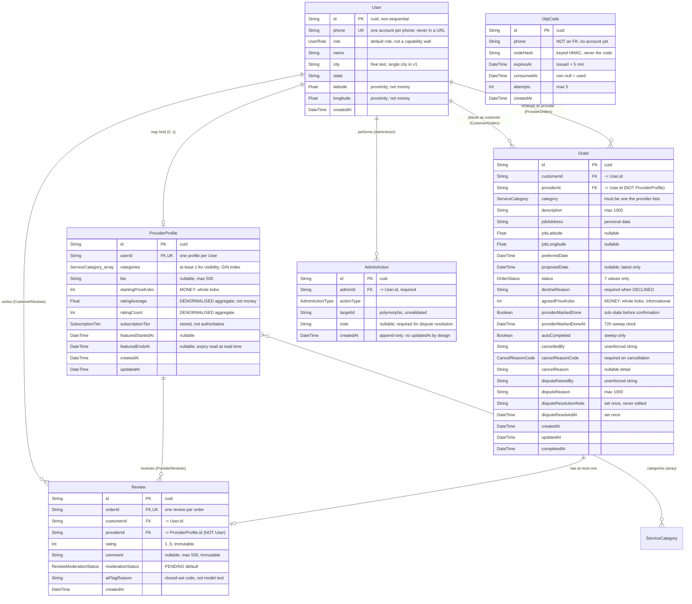

```mermaid
erDiagram
    User ||--o| ProviderProfile : "may hold (0..1)"
    User ||--o{ Order : "places as customer (CustomerOrders)"
    User ||--o{ Order : "receives as provider (ProviderOrders)"
    User ||--o{ Review : "writes (CustomerReviews)"
    User ||--o{ AdminAction : "performs (AdminActor)"
    ProviderProfile ||--o{ Review : "receives (ProviderReviews)"
    Order ||--o| Review : "has at most one"
    ProviderProfile }o--o{ ServiceCategory : "categories (array)"

    User {
        String id PK "cuid, non-sequential"
        String phone UK "one account per phone; never in a URL"
        UserRole role "default role, not a capability wall"
        String name
        String city "free text, single city in v1"
        String state
        Float latitude "proximity; not money"
        Float longitude "proximity; not money"
        DateTime createdAt
    }

    ProviderProfile {
        String id PK "cuid"
        String userId FK,UK "one profile per User"
        ServiceCategory_array categories "at least 1 for visibility; GIN index"
        String bio "nullable, max 500"
        Int startingPriceKobo "MONEY: whole kobo"
        Float ratingAverage "DENORMALISED aggregate; not money"
        Int ratingCount "DENORMALISED aggregate"
        SubscriptionTier subscriptionTier "stored, not authoritative"
        DateTime featuredStartedAt "nullable"
        DateTime featuredEndsAt "nullable; expiry read at read time"
        DateTime createdAt
        DateTime updatedAt
    }

    OtpCode {
        String id PK "cuid"
        String phone "NOT an FK: no account yet"
        String codeHash "keyed HMAC, never the code"
        DateTime expiresAt "issued + 5 min"
        DateTime consumedAt "non-null = used"
        Int attempts "max 5"
        DateTime createdAt
    }

    Order {
        String id PK "cuid"
        String customerId FK "-> User.id"
        String providerId FK "-> User.id  (NOT ProviderProfile)"
        ServiceCategory category "must be one the provider lists"
        String description "max 1000"
        String jobAddress "personal data"
        Float jobLatitude "nullable"
        Float jobLongitude "nullable"
        DateTime preferredDate
        DateTime proposedDate "nullable; latest only"
        OrderStatus status "7 values only"
        String declineReason "required when DECLINED"
        Int agreedPriceKobo "MONEY: whole kobo, informational"
        Boolean providerMarkedDone "sub-state before confirmation"
        DateTime providerMarkedDoneAt "72h sweep clock"
        Boolean autoCompleted "sweep only"
        String cancelledBy "unenforced string"
        CancelReasonCode cancelReasonCode "required on cancellation"
        String cancelReason "nullable detail"
        String disputeRaisedBy "unenforced string"
        String disputeReason "max 1000"
        String disputeResolutionNote "set once, never edited"
        DateTime disputeResolvedAt "set once"
        DateTime createdAt
        DateTime updatedAt
        DateTime completedAt
    }

    Review {
        String id PK "cuid"
        String orderId FK,UK "one review per order"
        String customerId FK "-> User.id"
        String providerId FK "-> ProviderProfile.id  (NOT User)"
        Int rating "1..5, immutable"
        String comment "nullable, max 500, immutable"
        ReviewModerationStatus moderationStatus "PENDING default"
        String aiFlagReason "closed-set code, not model text"
        DateTime createdAt
    }

    AdminAction {
        String id PK "cuid"
        String adminId FK "-> User.id, required"
        AdminActionType actionType
        String targetId "polymorphic, unvalidated"
        String note "nullable; required for dispute resolution"
        DateTime createdAt "append-only: no updatedAt by design"
    }
```